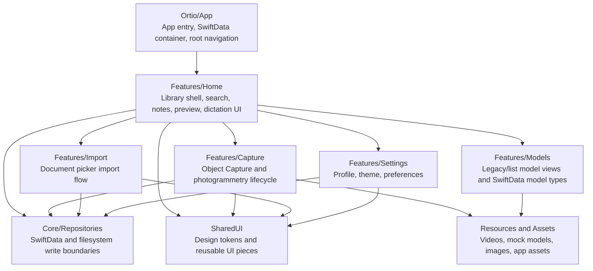
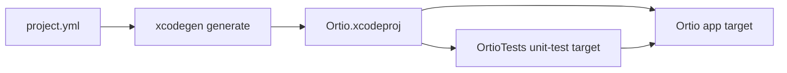
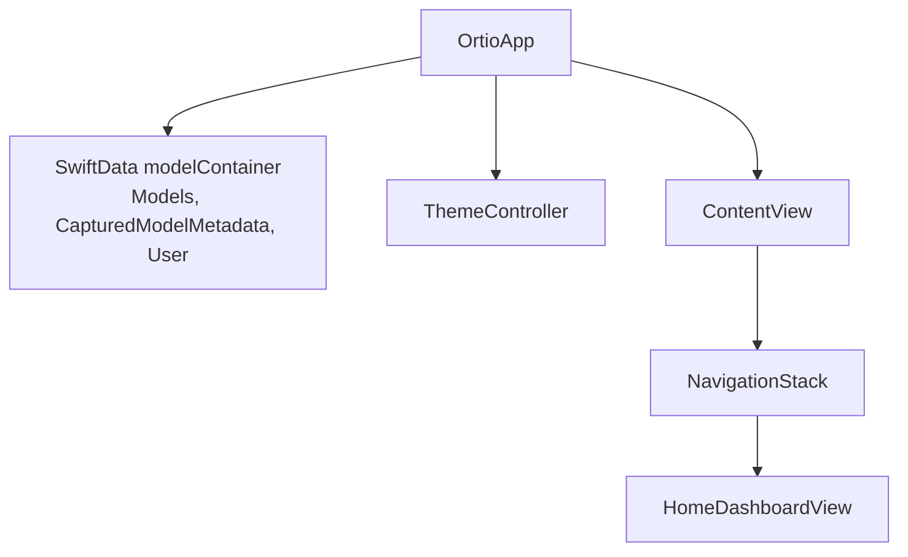
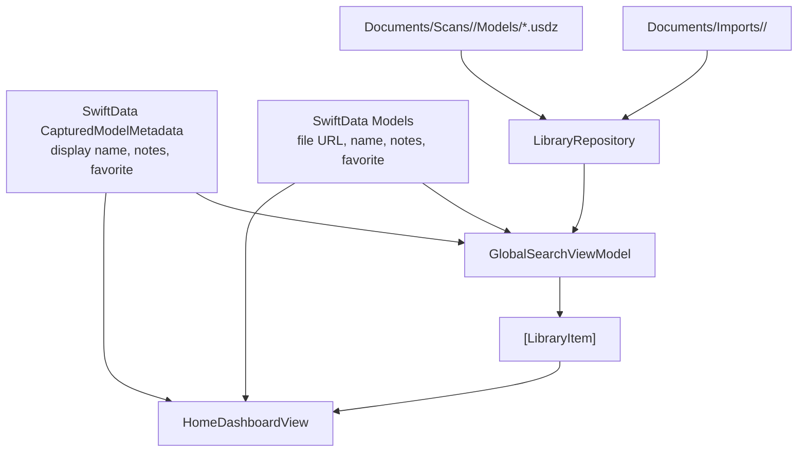
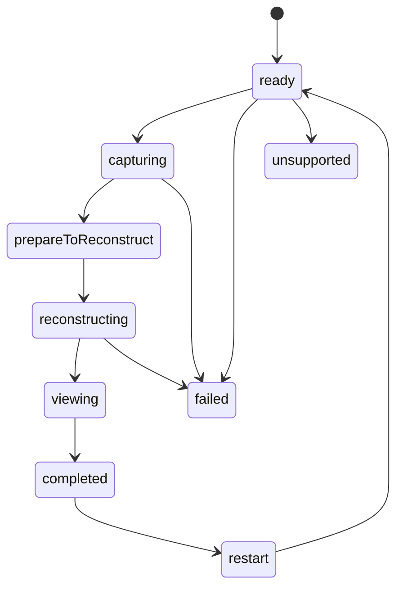
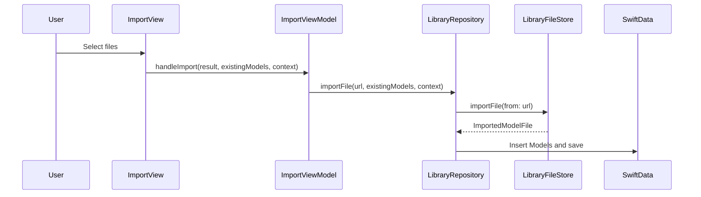
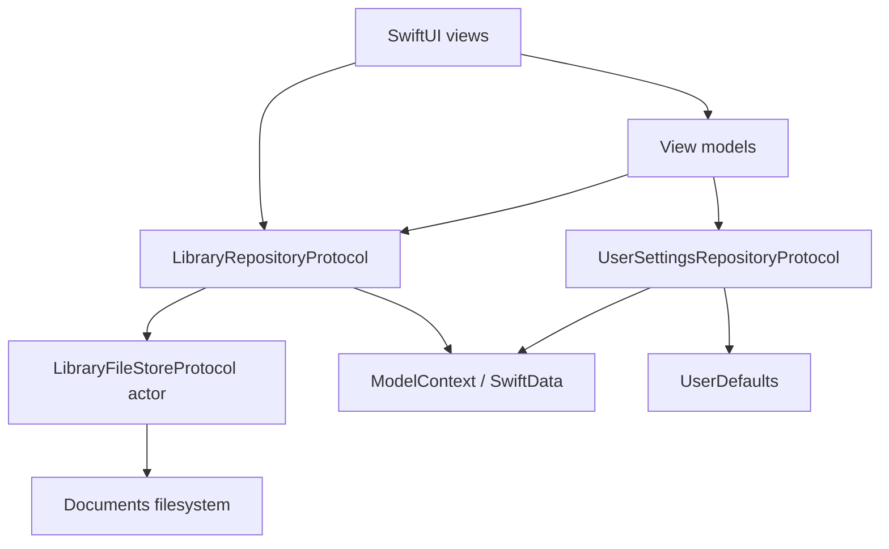

# Ortio Architecture

This guide is for future agents and maintainers who need to find the right owner before changing behavior. It explains the active iOS app as it exists in this repository today.

## Product Shape

Ortio is a SwiftUI iOS app for capturing, importing, browsing, previewing, annotating, and customizing 3D model library items. The supported source tree is `Ortio/`; the supported test target is `OrtioTests/`.



## Build Graph

`project.yml` is the source of truth for Xcode project generation.



Use these commands for normal verification:

```bash
xcodegen generate
xcodebuild test -project Ortio.xcodeproj -scheme Ortio -destination 'platform=iOS Simulator,name=iPhone 16 Pro'
```

If `iPhone 16 Pro` is unavailable, use an installed iOS simulator and state the substitution.

## App Root

`Ortio/App/OrtioApp.swift` creates the SwiftData model container for `Models`, `CapturedModelMetadata`, and `User`. It owns `ThemeController` as a `@StateObject`, reads the first saved `User`, and applies the stored theme when the user theme changes.

`Ortio/App/ContentView.swift` is intentionally thin. It installs a `NavigationStack`, starts at `HomeDashboardView`, and applies the Ortio accent tint.



## Library Domain

The library UI combines two different storage models into one `LibraryItem` list.

Captured models are discovered from the filesystem under `Documents/Scans/<session>/Models`. Their user-editable metadata is stored separately as `CapturedModelMetadata` keyed by standardized model URL.

Imported models are copied under `Documents/Imports/<folder>/...` and represented directly by SwiftData `Models` records.



Key files:

- `Ortio/Features/Home/Views/HomeDashboardView.swift`: primary shell for library browsing, search, preview, editor sheets, capture/import/settings entry points, and library bootstrap.
- `Ortio/Features/Home/Models/LibraryItem.swift`: normalized display item used by home/search/preview.
- `Ortio/Features/Home/ViewModels/GlobalSearchViewModel.swift`: merges captured and imported items, sorts favorites first, then newest-first, then title.
- `Ortio/Core/Repositories/LibraryRepository.swift`: main boundary for library mutations.
- `Ortio/Core/Repositories/LibraryFileStore.swift`: actor-isolated filesystem implementation.

## Capture Flow

Capture uses Apple Object Capture and photogrammetry APIs through `AppDataModel`. This area intentionally keeps the existing `ObservableObject` and `EnvironmentObject` pattern because the state machine owns live session objects, listener tasks, cleanup, and reconstruction.



Key files:

- `Ortio/Features/Capture/ViewModels/AppDataModel.swift`: object capture and photogrammetry owner.
- `Ortio/Features/Capture/ViewModels/AppDataModel+State.swift`: capture state enum.
- `Ortio/Features/Capture/ViewModels/AppDataModel+Orbit.swift`: orbit guidance, icon, and tutorial video mapping.
- `Ortio/Features/Capture/Models/CaptureFolderManager.swift`: capture folder layout helper.
- `Ortio/Features/Capture/Views/LoadOrtioView.swift`: capture entry/loading view.
- `Ortio/Features/Capture/Views/CapturePrimaryView.swift`: active capture screen.
- `Ortio/Features/Capture/Views/ReconstructionPrimaryView.swift`: reconstruction screen.
- `Ortio/Features/Capture/AGENTS.md`: local rules for lifecycle-sensitive edits.

## Import Flow

Import is a thin UI plus repository-backed file copy.



`ImportViewModel` keeps import/delete error messages in view-model state, but actual file operations and SwiftData writes go through `LibraryRepository`.

## Settings and Theme

Settings has two persistence paths:

- `UserDefaults` for preferences such as notifications, sound effects, and emails.
- SwiftData `User` for profile and theme.

`ThemeController` applies the selected theme globally from the app root. `SettingsViewModel` saves theme/profile changes through `UserSettingsRepository`.

## Native Dictation

The home notes flow can record audio and transcribe it with iOS Speech recognition. `NativeDictationService` requires speech authorization, a local audio file, an available recognizer for the chosen locale, and on-device recognition support. `VoiceNoteRecorder` owns `AVAudioRecorder`, metering state, temporary file URLs, and audio-session activation.

This flow is intentionally local-device based. It does not call a remote API or require an API key.

## Shared UI

`Ortio/SharedUI/OrtioDesignSystem.swift` contains the shared palette, surface colors, radius tokens, card modifier, and Liquid Glass/fallback header helpers.

Use shared tokens before adding one-off color, radius, or shadow values. If a new pattern appears in more than one feature, move it into `SharedUI` as a focused component or modifier.

## Persistence and Filesystem Boundaries

Views may read SwiftData through `@Query`, but writes should go through repositories.



Repository protocols are test seams. Mock them when behavior can be tested without real filesystem or SwiftData side effects.

## Tests

The active tests are under `OrtioTests/` and use Swift Testing for new coverage. Existing XCTest files are legacy and should not be expanded unless the work is explicitly a migration step.

High-value test areas:

- `OrtioTests/Core`: repositories, file store, theme controller.
- `OrtioTests/Features/Home`: dictation service, search view model, search transition coordinator.
- `OrtioTests/Features/Import`: import view model and import behavior.
- `OrtioTests/Features/Capture`: deterministic capture utilities.
- `OrtioTests/Shared`: SwiftData model behavior and helper structs.

## Documentation Map

- `AGENTS.md`: top-level development guide and repo conventions.
- `docs/architecture.md`: this architecture explanation.
- `docs/workflows.md`: task-oriented guides for common changes.
- `Ortio/**/AGENTS.md`: local rules where future agents can make expensive mistakes.
- DocC comments in source: contracts, invariants, lifecycle, threading, cancellation, and ownership rules for non-obvious APIs.
